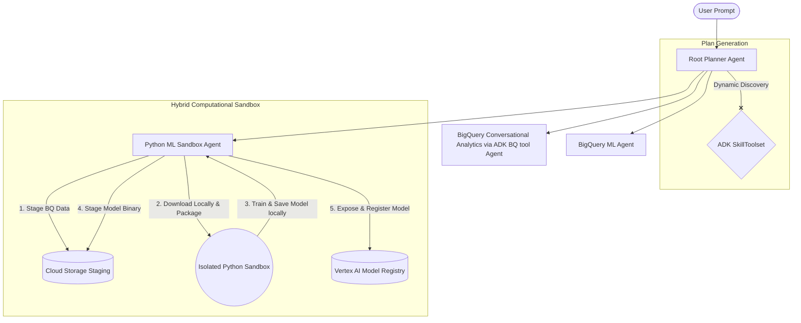

# Data Science Multi-Agent System (Powered by Google ADK & Gemini)

A production-grade, multi-agent orchestrator designed for automated data science, SQL generation, and custom machine learning training. Built natively on the **Google Agent Development Kit (ADK)** and powered by **Gemini**, this repository showcases a robust **Planner-Specialist** pattern that translates natural language questions into structured analytics and deployed models.

---

## 1. System Architecture & Flow

This system separates concerns by using a central coordinator (Planner) that orchestrates a network of specialized sub-agents:



### The Specialists:
- **Root Planner Agent:** Orchestrates the session, maps out the execution strategy, solicits human approval for execution, and delegates tasks.
- **BigQuery Conversational Analytics via ADK BQ tool Agent:** Translates natural language queries into Standard SQL using the ADK BigQuery tools and executes them against BigQuery.
- **BigQuery ML Specialist:** Designs, trains, and evaluates SQL-based BigQuery ML models.
- **Python ML Sandbox Specialist:** Handles custom Python machine learning runs (`scikit-learn`, `tensorflow`). Stages large datasets (up to 100MB) to Cloud Storage, coordinates local data packaging, trains models inside isolated sandboxed containers via `AgentEngineSandboxCodeExecutor`, and dynamically registers model binaries to the **Vertex AI Model Registry** from the host environment.

---

## 2. Advanced Architectural Patterns

### Progressive Skill Loading (`SkillToolset`)
To prevent monolithic system prompts from overwhelming LLM context windows, this agent leverages **ADK Skills** progressive disclosure:
- **Layer 1 (Metadata):** Simple short descriptions loaded during coordinator startup for capability matching.
- **Layer 2 (Instructions):** Core `SKILL.md` instructions loaded dynamically only when the agent triggers the skill.
- **Layer 3 (Resources):** Comprehensive code examples and reference architectures (`references/platform_guide.md`) loaded on-demand using the `load_skill_resource` tool.

### Hybrid GCS Staging for Large Datasets (Up to 100MB)
To avoid payload serialization bottlenecks inside API requests, datasets exceeding standard strings constraints are staged to GCS via `export_bq_to_gcs` prior to sandbox execution. The host tool dynamically downloads the GCS CSV bytes, encodes them to a base64 UTF-8 string, and packages them as local container input files. The Python training script reads `"input.csv"` locally and serializes the output locally to `"model.joblib"`, which the host tool then captures, uploads to GCS, and registers directly in Vertex AI.

---

## 3. Getting Started

### Prerequisites
- **Python 3.12+**
- **uv Package Manager** (Recommended): [Install uv](https://docs.astral.sh/uv/getting-started/installation/)
- **Google Cloud Project** with BigQuery and AI Platform APIs enabled.
- **Google Cloud CLI (gcloud)**: [Install gcloud CLI](https://cloud.google.com/sdk/docs/install)

### Installation & Auth Setup
1. Clone the repository:
   ```bash
   git clone <repository-url>
   cd data-science-agent
   ```

2. Synchronize dependencies and configure virtual environment:
   ```bash
   uv sync
   source .venv/bin/activate
   ```

3. Authenticate your local terminal with your Google Cloud credentials:
   ```bash
   gcloud auth login
   gcloud auth application-default login
   ```

### Environment Configuration
1. Rename `.env.example` to `.env` and configure your project identifiers:
   ```env
   GOOGLE_GENAI_USE_VERTEXAI=1
   GOOGLE_CLOUD_PROJECT=your-gcp-project-id
   GOOGLE_CLOUD_LOCATION=global
   VERTEX_LOCATION=us-central1
   MODEL_STAGING_BUCKET=gs://your-gcs-staging-bucket-name
   BQ_LOCATION=US
   DATASET_CONFIG_FILE=data_science/utils/project_config.json
   ```

2. **Register Database Schema:** Open [project_config.json](data_science/utils/project_config.json) (referenced via `DATASET_CONFIG_FILE` above) and replace `your-project-sales` and description placeholders with your actual target BigQuery tables and column definitions. This metadata registry is critical for the Planner Agent to discover and route queries to your datasets!

---

## 4. Running the Agent Locally

### Launch the Web Playground
Test the agent interactively inside your browser using the ADK Web Playground:
```bash
uv run adk web
# Access the UI at http://localhost:8000 and select the 'data_science' agent.
```

### Quick CLI Smoke Test
Run a quick, single-prompt smoke test directly inside your terminal:
```bash
agents-cli run "Show me the first 5 rows of the users table"
```

---

## 5. Deployment to Google Cloud (Agent Platform)

The repository includes an automated deployment script configured to deploy your agent to **Vertex AI Agent Platform Runtime** using the **Google-managed Agent Identity** for secure, least-privilege IAM governance:

1. Verify your configuration in `.env` is correct.
2. Run the deployment script:
   ```bash
   uv run python3 deploy_agent_platform.py
   ```

Once completed, the script outputs your deployed agent's resource name (e.g., `projects/.../locations/.../reasoningEngines/...`), ready to serve production traffic securely!

---

## 6. Evaluation & Testing

To run unit tests and behavioral evaluations:
1. Sync development dependencies:
   ```bash
   uv sync --dev
   ```
2. Run the test suite:
   ```bash
   uv run pytest tests
   ```
3. Run quality and behavioral evaluations:
   ```bash
   agents-cli eval run
   ```
